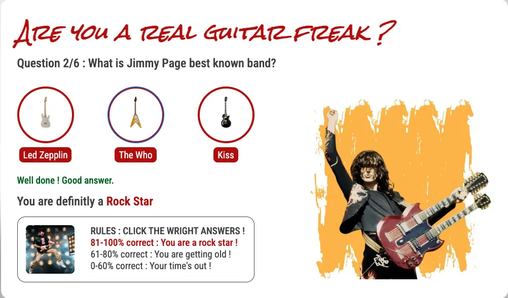

<h1>CHALLENGE 2 | JAVASCRIPT</h1>

<a style="text-decoration:underline;" target="_blank" href="https://philippeitsme.github.io/ci-portfoli02-js/">View the LIVE project here</a>

## USERSTORY (background)

The "Are you a real guitar freak ?" website has been developed to allow people to test their guitar heros knowledge.

The public of this website is mainly made of men between 40 and 60 year old who fully lived the 70' and the 80' and were deep into rock and hard rock music. 

The goal of this website is to entertain them and tease them about time passing by.

## FEATURES

### Frontend - HTML & CSS

The quizz is made of 6 questions and is finishing on a end of the game message.

Question 1
  
Question 2
  
Question 3
  
Question 4
  
Question 5
  
Question 6
  
End of the game message
  

### Frontend - JAVASCRIPT

The JAVASCRIPT is structured as follow : 

After having created an array of objects, that describe the questions of the quizz and a function that watch the hover of the user over the answers buttons, the code is going through the following functions : 

<ol>
    <li>getAnwer -> to capture the user answer</li>
    <li>checkAnswer -> to see if his answer is correct and to increment his score</li>
    <li>updateYouAre -> to udapte his success score and his classification (rock star, getting old or your time is out)</li>
    <li>displayNextQuestion -> to display the next question and the end of the game message</li>
    <li>reload -> to reload the game if wished by the user</li>
</ol>

Key elements : 

The displayed elements per question are : the question, three answers , the picture of the guitar hero.
   

The hover effect when user go over a answer with their mouse.
   

The good or wrong answer indication
  

The score displayed in the footer
  

The classification of the user related to his score.
  
  
  

## DESIGN & LANGUAGES

### Colorimetrie
Primary colors : red #AD0000; and yellow #FBB03B 
Secondary colors : antracite #414040 and white #ffffff 

### Typographie
Titles : Rock Salt (for the rock 'n' roll mood) 
Paragraphs : Roboto Condensed 

### Used Languages

<ul>
    <li>HTML5</li>
    <li>CSS</li>
    <li>JAVASCRIPT</li>
</ul>

## TESTING

I personnaly tested the website on Chrome, Safair, Firefox and on desktop, ipad and iphone. I invited a few friends to test the website and give me their feedbacks.

<ul>
    <li>Chrome : ✅</li>
    <li>Safari : ✅</li>
    <li>Firefox : ✅</li>
    <li>Responsivness (desktop, tablet and mobile): ✅</li>
</ul>

W3 Validator output : 

<ul>
    <li>W3 HTML Validator : ✅</li>
    <li>W3 CSS Validator ✅ : </li>
     
     
</ul>

Userstory testing : 
<ul>
    <li>Is it fun ? : ✅</li>
    <li>Is it easy to use ? : ✅</li>
    <li>Is it teasy without being unpolite : ✅</li>
</ul>

## PERFORMANCE (lighthouse)

Looking great ✅

## DEBUGGING

### HTML & CSS
No major issues on the HTML & CSS code. 

### JAVASCRIPT
Many synthax issues solved by reading again again and again the code in order to find the small mistakes.

### PERFORMANCE
Had to increase the guitar pictures resolution, who was to low.

## DEPLOYMENT

### VERSION CONTROL

The site was created using Visual Studio Code and Gitpod editor and pushed to Github to the remote repository "ci-portfolio2-js".

Git commands were used throughout the development to push the code to the remote repository. 

The following git commands were used:
<ul>
    <li>git add . - to add the files to the staging area before being committed.</li>
    <li>git commit -m "commit message" - to commit changes to the staging step.</li>
    <li>git push - to push all committed code to the remote repository on Github.</li>
</ul>

### DEPLOYMENT TO GITHUB PAGES

The site was deployed to Github as follow:
<ol>
    <li>In the Github repository, navigat to Settings tab</li>
    <li>From the source section drop-down menu, select the Master branch and Save</li>
    <li> Once the Master branch is selected, the page provided the link to the website</li>
</ol>

### CLONING OF THE REPOSITORY CODE LOCALLY

<ol>
    <li>Go to the Github repository that you want to clone</li>
    <li>Click on the Code button located above all the project files</li>
    <li>Click on HTTPS and copy the repository link</li>
    <li>Open the IDE of your choice and and paste the copied git url into the IDE terminal</li>
    <li>The project is now created as a local clone</li>
</ol>

## CREDITS

<ul>
    <li>Guitar images are from Thoman.de</li>
    <li>Guitar heros are from varius websites</li>
    <li>Thanks to my mentor Steven for this great support</li>
    <li>Thanks to the Code Institute Slack Community for their great support</li>
</ul>

The images have been taken form website without permission. Therefore, the website should not go public.